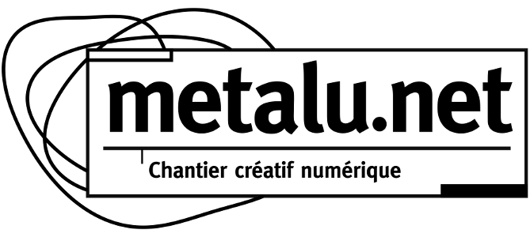

[metalu.net](http://metalu.net) is a collective of multidisciplinary artists and technicians, a place dedicated to the experimentation of new technologies in art, and a platform of resources serving digital artists.

[metalu.net](http://metalu.net) tries, as much as possible, to publish each new tool or project that has been part of its activities; for two main reasons:

- we think that sharing the knowledge is the way, that's why we focus on the use of free and open-source resources; so, when we come to build a new tool that we couldn't find ready-made, it seems logical to make it accessible to all (and maybe somebody will help us to fix some bug, or to add a new functionality).
- it's the simplest way for us to have the most recent version of our work available at any time!

For readability, we have separated common purpose tools from particular projects (e.g artistic works, or works resulting from a participative workshop):

## [metalunet repositories (https://github.com/MetaluNet)](https://github.com/MetaluNet) 

This set of repositories hosts our libraries and documentations that could be directly useful for other people.

## [metalunet-projects repositories (https://github.com/MetaluNetProjects)](https://github.com/MetaluNetProjects) 

Here is the memory of our daily activity. Anybody can have a look to these projects, which can help to understand how we usually manage such projects.

Generally each of these projects is the software layer of an artistic installation, involving a physical construction, and working with sound, video, sensors, or robotics. It can be a musical instrument, a light projection machine, a wifi controlled baby carriage...

Most of the time the project is built around [Pure Data](http://www.puredata.info), using [FRAISE](https://github.com/MetaluNet/Fraise) for interfacing with real world (sensors/actuators). When image projection is needed, we either use [Gem](http://puredata.info/downloads/gem), or [Pof](https://github.com/Ant1r/ofxPof) (also originating from metalu.net), which bring mobile-device and multi-touch support.

